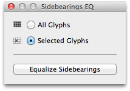

#SidebearingsEQ
**A tiny extension for RoboFont to equalize sidebearings for all or a selection of glyphs in a font.**

##Using SidebearingsEQ
SidebaringsEQ can be accessed via RoboFont's Extension Menu.

In the SidebearingsEQ window, select whether you wish to equalize the sidebearings of all glyphs in your font, or just the glyphs you currently have selected.

SidebearingsEQ will check the sidebearings of each glyph, and then distribute them equally to the left and right of your glyph. If the sum of your existing sidebearings is an odd number of UPM, it will add the remaining UPM to the right sidebearing of the glyph.

##Installing and De-installing SidebearingsEQ
To install SidebearingsEQ, simply double-click the extension. RoboFontsExtension Manager will take care of the rest. 

To de-install SidebearingsEQ, double-click again, and RoboFont will ask you whether you wish to de-install or re-install the extension.